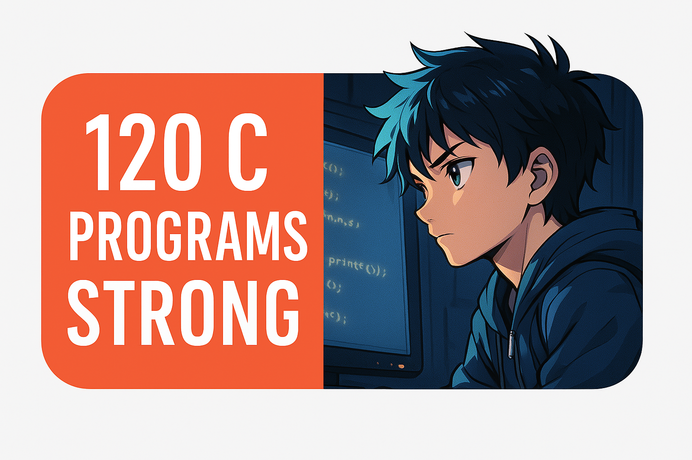

# 💻 My C Language Practice Vault

These C programs were built during my self-learning journey through the tutorials of Haris Ali Khan, popularly known as "CodeWithHarry".  
I'm deeply thankful for his efforts in making quality education accessible 🙏

## 📂 What's Inside

- 120+ C programs covering:
  - ✅ Loops  
  - ✅ Functions  
  - ✅ Arrays & Pointers  
  - ✅ File handling  
  - ✅ Logic-building exercises

🧠 All codes are handwritten, organized, and tested by me — reflecting consistent effort and growth.

🚀 Stay tuned for real-world projects as my skills expand!
